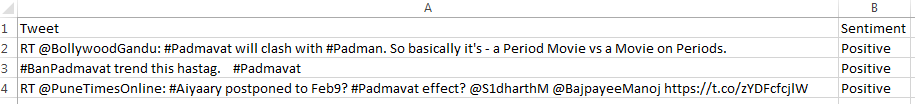
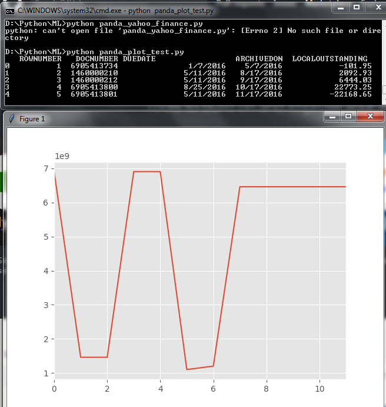

# Machine Learning - Practice

# Marathi to English translator using Keras: Practice application

Instructions:
1. Download Tab delimeter bilingual sentence pair file for Marathi to English from: http://www.manythings.org/anki/
2. Unzip it as 'mar.txt'(already present at my root directory).
3. Execute given python files as per below sequence:
    1. pulling.py (Creating datapoints file)
    2. cleaning.py (Cleaning, splitting and validating data with package creation)
    3. initial.py (Train and test model with data lines, final model creation)
    4. translater.py (Using model to test in Dev )
4. Major packages required like keras, tensorflow, numpy, scikit-learn..etc.

Credit:

Thanks to 'https://machinelearningmastery.com'

Screenshots:

Comming soon...

# Sentiment analysis with Twitter Developer API:

# Panda Test with plot:

